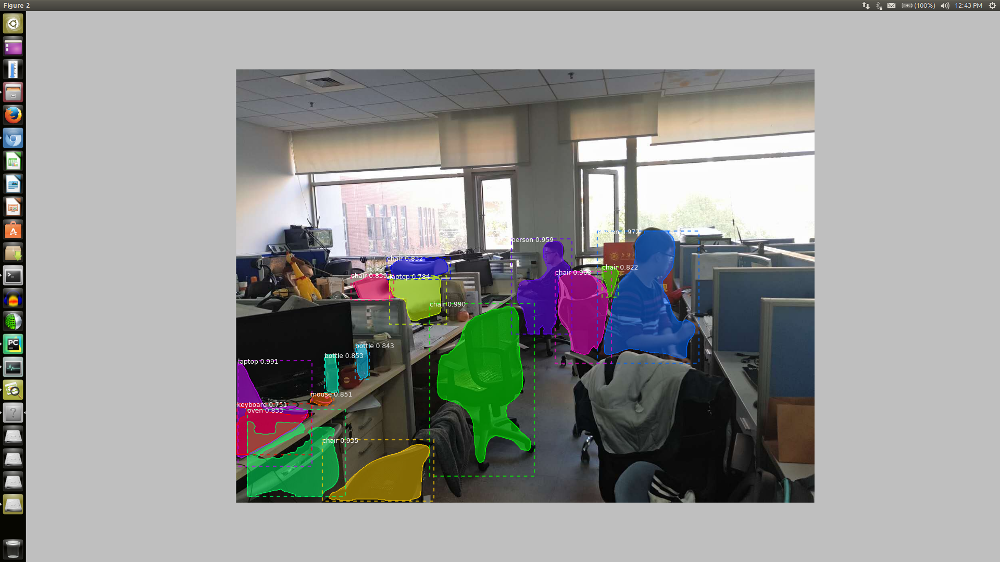
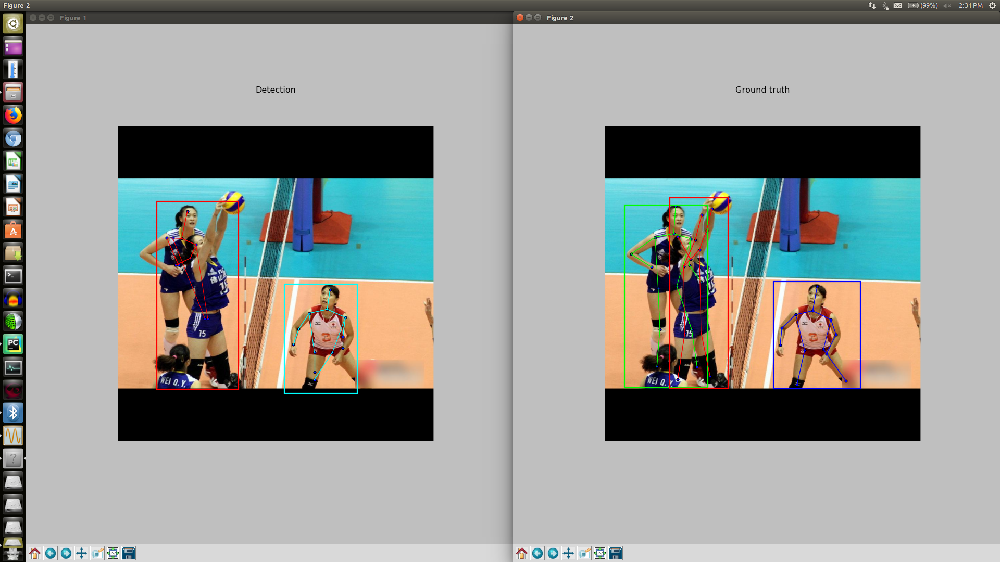
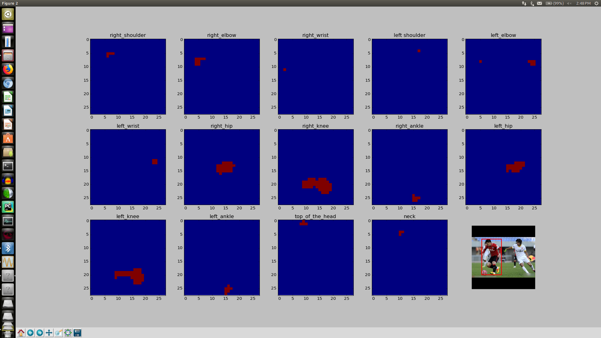

# Mask_R_CNN_Keypoints
The original code is from "https://github.com/matterport/Mask_RCNN" on Python 3, Keras, and TensorFlow.
The code recovers the work of "https://arxiv.org/abs/1703.06870" but does not include the of keypoints.  
So the work that ralice is, modifying the code to perform the detection of keypoints

### segmented image with the original code

This image is one of the first tests, there is no mean average presition mAP
The resunts are far from the original paper

### Test Picture for keypoints

### Network output

This picture reprecents the last layer in the betwork
